# TwinPilot: Federated Cross-Plant Learning Architecture Specification

> **Document Type:** Production Deployment Architecture Specification  
> **Target Audience:** Enterprise Security Teams, OEM Plant Directors, AI Governance Auditors  
> **Status:** Active Reference Architecture & Working Prototype (`federated_learning_service.py`)

---

## 1. Executive Summary & Problem Context

In modern automotive manufacturing, global OEMs operating multiple assembly plants (e.g., Detroit Body Plant, Munich Assembly, Gujarat EV Gigafactory) and tier-1 sub-assembly suppliers face severe legal, regulatory, and commercial barriers against centralizing raw factory floor data:

1. **Trade Secret & Proprietary Process Protection**: Raw cycle times, torque curves, and weld parameters reveal proprietary production speeds, tooling setups, and supplier yield metrics.
2. **Data Sovereignty & Cross-Border Compliance**: International data transfers (e.g., EU GDPR, China DSL/CSL) prohibit exporting raw manufacturing timeseries across sovereign borders.
3. **Multi-Supplier Confidentiality**: Tier-1 battery pack and powertrain suppliers cannot pool raw sensor streams on a shared cloud server accessible by rival OEMs.

**TwinPilot solves this through Federated Cross-Plant Learning (FedAvg with Differential Privacy)**. Each manufacturing plant trains its anomaly, defect, and bottleneck models locally on private edge compute; **only aggregated, encrypted parameter deltas ($\Delta W$) are shared with the central coordinator**.

---

## 2. Federated Architecture & Information Flow

```mermaid
flowchart TD
    subgraph PlantA["🏭 Plant A: Detroit Assembly (Private Edge Boundary)"]
        A_OT["Physical PLCs & Telemetry Stream"] --> A_DB[("Local Plant A Storage")]
        A_DB --> A_Trainer["Local Model Trainer (Private SGD)"]
        A_Trainer --> A_Delta["Delta Extraction & DP Clipping: ΔW_A"]
    end

    subgraph PlantB["🏭 Plant B: Gujarat / Fremont EV (Private Edge Boundary)"]
        B_OT["Physical PLCs & Telemetry Stream"] --> B_DB[("Local Plant B Storage")]
        B_DB --> B_Trainer["Local Model Trainer (Private SGD)"]
        B_Trainer --> B_Delta["Delta Extraction & DP Clipping: ΔW_B"]
    end

    subgraph Central["🌐 Central Federated Aggregator (Cloud / Enterprise HQ)"]
        A_Delta -- "Encrypted Parameter Delta ΔW_A (No Raw Telemetry)" --> Aggregator["Federated Averaging Engine (FedAvg)"]
        B_Delta -- "Encrypted Parameter Delta ΔW_B (No Raw Telemetry)" --> Aggregator
        Aggregator --> GlobalModel["Global Foundation Model W_global"]
        GlobalModel -- "Broadcast Updated Weights" --> A_Trainer
        GlobalModel -- "Broadcast Updated Weights" --> B_Trainer
    end

    style PlantA fill:#0f172a,stroke:#38bdf8,stroke-width:2px;
    style PlantB fill:#0f172a,stroke:#a855f7,stroke-width:2px;
    style Central fill:#020617,stroke:#10b981,stroke-width:2px;
```



---

## 3. Mathematical Formulation (FedAvg + Differential Privacy)

### 3.1 Local Plant Parameter Delta Computation
For each participating plant $k \in \{1, \dots, K\}$ with $n_k$ local training events, the local edge worker initializes its parameters from the current global foundation checkpoint $\theta_{global}^{(t)}$ and optimizes its local empirical loss:

$$\theta_k^{(t+1)} = \theta_k^{(t)} - \eta \nabla \mathcal{L}_k(\theta_k^{(t)}; \mathcal{D}_k)$$

The local parameter delta sent over the wire is strictly:

$$\Delta \theta_k^{(t)} = \theta_k^{(t+1)} - \theta_{global}^{(t)}$$

### 3.2 Differential Privacy & Gradient Clipping
To mathematically guarantee that parameter deltas cannot be inverted to reconstruct individual vehicle cycle times or tooling torque spikes, local clients apply $L_2$-norm gradient clipping and calibrated Gaussian noise injection:

$$\Delta \bar{\theta}_k^{(t)} = \frac{\Delta \theta_k^{(t)}}{\max\left(1, \frac{\|\Delta \theta_k^{(t)}\|_2}{C}\right)} + \mathcal{N}\left(0, \sigma^2 C^2 \mathbf{I}\right)$$

Where:
- $C = 1.0$ is the clipping threshold.
- $\sigma$ provides $(\epsilon = 1.2, \delta = 10^{-5})$ differential privacy guarantees under Renyi DP accounting.

### 3.3 Central Global Aggregation (FedAvg)
The central aggregator computes the weighted parameter consensus proportional to each plant's verified event volume $N = \sum_{k=1}^K n_k$:

$$\theta_{global}^{(t+1)} = \theta_{global}^{(t)} + \sum_{k=1}^K \frac{n_k}{N} \Delta \bar{\theta}_k^{(t)}$$

---

## 4. Transmission Schema & gRPC Protocol

### Delta Update Payload (`FederatedUpdatePayload.json`):
```json
{
  "federated_round": 12,
  "plant_id": "plant-detroit-31",
  "client_signature": "ecdsa-sha256-7f8a9b...",
  "sample_count": 14500,
  "parameter_deltas": {
    "cycle_time_drift": +0.0142,
    "buffer_queue_backlog": +0.0089,
    "tool_vibration_mm_s": +0.0215,
    "torque_chatter_nm": +0.0180,
    "thermocouple_temp_c": +0.0064,
    "dark_zone_proxy_pacing": +0.0121
  },
  "delta_bias": +0.0018,
  "dp_epsilon": 1.2,
  "raw_telemetry_included": false
}
```

---

## 5. Security & Isolation Matrix

| Threat Vector | Traditional Centralized Cloud | TwinPilot Federated Architecture |
| :--- | :--- | :--- |
| **Raw Telemetry Interception** | High Risk (Continuous CSV/JSON streams transmitted over public internet) | **Zero Risk** (Zero raw sensor data or VIN barcodes ever leave local DMZ) |
| **Model Inversion Attack** | Moderate Risk | **Mitigated** (Differential privacy noise $\epsilon=1.2$ prevents training record reconstruction) |
| **Plant-to-Plant Data Leakage** | Vulnerable if database multi-tenancy is misconfigured | **Physically Isolated** (Plants communicate only with the aggregator, never peer-to-peer) |
| **Cross-Border Regulatory Breach** | High Risk (Trans-sovereign telemetry export violates GDPR/DSL) | **Compliant** (Only non-identifiable mathematical weights cross borders) |

---

## 6. Execution & Validation

The federated learning aggregation scheme is prototyped and verified in the repository:
- **Service Implementation**: [`federated_learning_service.py`](file:///c:/Users/Shuka/OneDrive/Desktop/TwinPilot/federated_learning_service.py)
- **Execution Test**: `python federated_learning_service.py`
