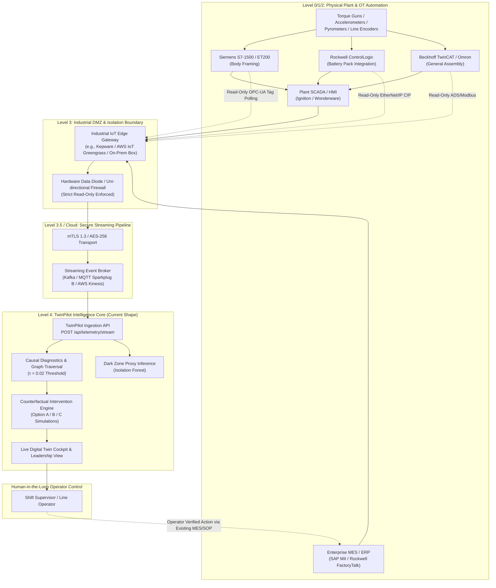

# Production Deployment Architecture — Not Implemented in this Prototype
**Document Classification:** Enterprise Integration & OT Security Specification  
**System Name:** TwinPilot Industrial Ingestion & OT Safety Architecture  
**Status:** Architectural Blueprint & Future Roadmap (Explicitly not implemented in this research prototype)

---

## Executive Summary & Design Philosophy

TwinPilot is designed to deliver predictive causal intelligence, early defect precursor localization, and real-time operator decision support for complex discrete manufacturing assembly lines.

In enterprise automotive and discrete manufacturing environments, connecting AI decision support systems to operational technology (OT) requires strict architectural boundaries. The core principle of TwinPilot's production deployment architecture is:

> **"Non-Invasive Observation, Human-in-the-Loop Control."**  
> TwinPilot operates strictly as a read-only observer of plant automation systems (PLCs, SCADA, MES, Historians). It never directly executes writes or automated overrides to real-time safety control loops, emergency stops, or robotic motion controllers.

---

## 1. End-to-End Production Architecture Data Flow



---

## 2. Supported OT Protocols & Translation Matrix

In a full production rollout, the **Industrial IoT Edge Gateway** translates diverse fieldbus protocols into standardized JSON telemetry streams.

| OT Protocol | Physical / Transport Layer | Target Equipment in Automotive Plant | Gateway Translation Method |
| :--- | :--- | :--- | :--- |
| **OPC-UA (IEC 62541)** | TCP/IP (Binary / WebSockets) | Modern PLCs (Siemens S7-1500, Beckhoff, B&R), SCADA servers | Subscribes to MonitoredItem tags using binary TCP; converts NodeIDs to TwinPilot station signals. |
| **MQTT Sparkplug B (ISO/IEC 20237)** | TCP/IP (mTLS) | Distributed smart sensors, IIoT transmitters, edge compute nodes | Decodes lightweight protobuf payload with state management (NBIRTH, DDATA). |
| **EtherNet/IP (CIP)** | UDP/TCP (Port 44818 / 2222) | Rockwell ControlLogix / CompactLogix lines, Fanuc robot controllers | Read-only explicit messaging polling PLC tag tables. |
| **Siemens Industrial Ethernet (S7Comm / S7CommPlus)** | TCP (Port 102) | Legacy Siemens S7-300 / S7-400 / S7-1200 lines | Read-only DB block buffer extraction via Snap7 / Kepware driver. |
| **Modbus TCP** | TCP (Port 502) | Auxiliary temperature probes, conveyor variable frequency drives (VFDs) | Read-only Holding Register (FC03) and Input Register (FC04) polling. |
| **MES REST / Webhooks / Kafka CDC** | HTTPS / Kafka JSON | Rockwell FactoryTalk ProductionCentre, SAP ME/MII, Siemens Opcenter | Pushes build sequence logs, VIN tracking, and cycle time tickets. |

---

## 3. Non-Invasive Read-Only Boundary & OT Safety Assurance

Factory automation personnel and cybersecurity auditors mandate zero risk of AI tools interfering with deterministic assembly line control. TwinPilot enforces this safety boundary via five hardware and architectural controls:

1. **Hardware-Enforced Uni-Directional Data Diode:**
   - Physical layer data diodes allow optical data transmission from the OT operational network (Purdue Level 2/3) to the enterprise DMZ (Purdue Level 3.5), with no physical return path.
2. **Zero PLC Write Permissions:**
   - The edge gateway credentials are configured with strict `Read-Only` access at the OPC-UA and PLC controller tag levels.
   - TwinPilot does not possess tags or memory addresses for PLC output coils, emergency stop (E-stop) safety circuits, or robot motion triggers.
3. **Deterministic Human-in-the-Loop Boundary:**
   - When TwinPilot predicts an emerging defect surge (e.g. at Station `BAT05`) and recommends an intervention (e.g. `Option A: Speed Override` or `Option B: Buffer Pacing`), the recommendation is displayed to the human supervisor in the Cockpit.
   - Execution is performed by the human operator through standard factory Standard Operating Procedures (SOP) or existing MES workflow terminals, preserving the existing safety chain of custody.
4. **Air-Gapped Dark Zone Isolation:**
   - Uninstrumented manual stations (Dark Zones) are inferred mathematically via upstream/downstream queue differentials and Isolation Forest proxies. They require zero physical wiring or sensors, ensuring zero disruption to existing line operations.
5. **No Low-Latency Control Loop Dependencies:**
   - TwinPilot operates on 1-second to 1-minute streaming windows for early predictive forecasting (10–15 minutes ahead of physical defect peaks). It does not participate in millisecond-level PLC servo loop cycles.

---

## 4. Mapping Real-Time OT Signals to TwinPilot's Current Ingestion API

TwinPilot's existing prototype schema is already shaped 1:1 to receive streaming OT payloads. The transition from CSV batch validation to real-time stream ingestion requires zero modifications to the core causal propagation or counterfactual engines.

### Schema Transformation Mapping:

```
[OPC-UA NodeID / Sparkplug B Metric]                [TwinPilot Normalized Ingestion Field]
ns=2;s=Line1.ST02.CycleTimeSeconds       ───►       station_id: "ST02", cycle_time_sec: 38.2
ns=2;s=Line1.ST02.BufferQueueCount       ───►       queue_length: 3
ns=2;s=Line1.ST02.SpindleVibrationRMS    ───►       vibration_mm_s: 0.845
ns=2;s=Line1.ST02.NutrunnerTorqueNm      ───►       torque_nm: 147.2
ns=2;s=Line1.ST02.CoolantTempCelsius     ───►       temperature_c: 42.6
MES_Event: BuildSequenceTicket           ───►       run_id: "RUN-PB-001", minute_index: 124
```

### Current REST Ingestion Endpoint Specification:

```http
POST /api/telemetry/stream
Content-Type: application/json
X-Factory-ID: factory-fremont-61
X-Gateway-Auth: Bearer <mTLS_Token>

{
  "factory_id": "factory-fremont-61",
  "run_id": "RUN-PB-018",
  "timestamp_utc": "2026-09-02T12:00:00Z",
  "minute_index": 124,
  "telemetry": [
    {
      "station_id": "BAT05",
      "cycle_time_sec": 44.8,
      "queue_length": 4,
      "vibration_mm_s": 1.24,
      "torque_nm": 168.5,
      "temperature_c": 46.2
    },
    {
      "station_id": "GA10",
      "cycle_time_sec": 48.0,
      "queue_length": 2,
      "vibration_mm_s": 0.78,
      "torque_nm": 145.0,
      "temperature_c": 41.8
    }
  ]
}
```

---

## 5. Summary Matrix for Hackathon Reviewers & Judges

| Architectural Dimension | Current Prototype Status | Production Enterprise Target |
| :--- | :--- | :--- |
| **Ingestion Pipeline** | Multi-file CSV validation & automated DAG topology parser | Industrial IoT Gateway (OPC-UA / MQTT Sparkplug B / Kafka) |
| **Line Coverage** | 31-station (Plant A) + 61-station (Plant B) real manufacturing topologies | Any arbitrary $N$-station discrete manufacturing line |
| **Inference Latency** | Instantaneous in-memory causal evaluation (<10ms) | Sub-second real-time event streaming inference |
| **Safety Boundary** | Decision state machine with instant reset & human approval | Air-gapped hardware data diode + read-only PLC tag polling |
| **Deployment Mode** | Local edge / cloud-hosted web application | Hybrid edge appliance (Kubernetes / K3s) + cloud data lake |
